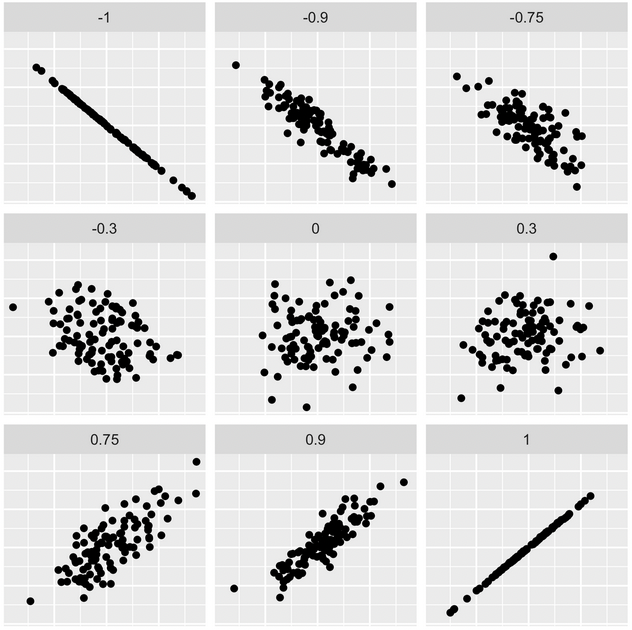

```{r setup, include=FALSE}
# Load knitr package
library(knitr)

# Knitr Options
opts_chunk$set(
	echo = TRUE,
	message = FALSE,
	warning = FALSE
)
```

# Summary
This chapter will introduce you to some background theory and terminology for modeling, in particular, the general modeling framework, the difference between modeling for explanation and modeling for prediction, and the modeling problem. Furthermore, you'll start performing your first exploratory data analysis, a crucial first step before any formal modeling.

# Background on Modeling for Explanation
## General Modeling Framework Formula

The **general modeling framework formula** is $y = f(\vec{x}) + \epsilon$ where:

* $y$ is the outcome variable of interest
* $\vec{x}$ is the set of explanatory or predictor variables used to inform your model
* $f()$ is a mathematical function of the relationship between $y$ and $\vec{x}$ AKA *the signal*
* $\epsilon$ is the unsystematic error component AKA *the noise*

## Two Modeling Scenarios
Modeling for either:

* Explanation: $\vec{x}$ are *explanatory variables*
* Prediction: $\vec{x}$ are *predictor variables*

## Dataset
A University of Texas in Austin [University of Texas Austin](https://www.utexas.edu/) study on teaching evaluation scores (available at [openintro.org](https://openintro.org)).

## Question
Can we explain differences in teaching evaluation score based on various other teacher attributes?

## Variables

* $y$: Average teaching `score` based on student evaluations
* $\vec{x}$: Attributes like `rank`, `gender`, `age` or `bty_avg`

## The `moderndive` Package
The `evals` dataframe included in the `moderndive` package contains this data. The `moderndive` package is used in [ModernDive.com](https://moderndive.com/), an open-source written and published electronic textbook on statistical and data sciences. This package includes other data and functions you'll be using in this course. Let's preview the data using the `glimpse` function from the `dplyr` package.

```{r glimpse-evals, message=FALSE, warning=FALSE}
# Load packages
library(dplyr)
library(moderndive)

# Preview the evals data
glimpse(evals)
```

Observe that there are 463 instructors and 14 variables in this data frame.

## Exploratory Data Analysis
A crucial first step is an **exploratory data analysis**, or **EDA**. EDA gives you a sense of your data and it can help inform model construction. There are three basic steps to an EDA:

* Looking at the data
* Creating visualizations
* Computing summary statistics

Let's do this for the outcome variable `score`.

Since `score` is numerical, let's construct a histogram to visualize its distribution by using a `geom-histogram` from the `ggplot2` package, where the x-aesthetic is mapped to `score`. Let's also set a `binwidth` of 0.25.

```{r hist-score}
# Load packages
library(ggplot2)

# Build histogram for score
ggplot(evals, aes(x = score)) +
  geom_histogram(binwidth = 0.25) +
  labs(x = "teaching score", y = "count")
```

The largest score is 5 and most scores are between about 3-5. But what's the average? Let's perform the third step in our EDA, computing summary statistics.

Summary statistics summarize many values with a single value called a statistic. Let's compute three such summary statistics using the `summarize()` function. 
```{r summary-score}
evals %>% 
  summarise(mean_score = mean(score),
            median_score = median(score),
            sd_score = sd(score))
```

The mean, or average, score is 4.17, whereas the median of 4.3 indicates about half the instructors had scores below 4.3 and about half above. The standard deviation, a measure of spread and variation, is 0.544. 

## Exploratory Visualization of Age
Let's perform an exploratory data analysis (EDA) of the numerical explanatory variable `age`. You should always perform an exploratory analysis of your variables before any formal modeling. This will give you a sense of your variable's distributions, any outliers, and any patterns that might be useful when constructing your eventual model.

```{r hist-age}
# Plot the histogram
ggplot(evals, aes(x = age)) +
  geom_histogram(binwidth = 5) +
  labs(x = "age", y = "count")
```

## Numerical Summaries of Age
Let's continue our exploratory data analysis of the numerical explanatory variable `age` by computing summary statistics. Summary statistics take many values and summarize them with a single value. Let's compute three such values using `dplyr` data wrangling: mean (AKA the average), the median (the middle value), and the standard deviation (a measure of spread/variation).

```{r summary-age}
# Compute summary stats
evals %>%
  summarise(mean_age = mean(age),
            median_age = median(age),
            sd_age = sd(age))
```

# Background on Modeling for Prediction
## Dataset
A dataset of house prices in King County, Washington State, near Seattle (available at [Kaggle.com](https://www.kaggle.com/harlfoxem/housesalesprediction))

## Question
Can we predict the sale price of houses based on their features?

## Variables

* $y$: House sale `price` in US dollars
* $\vec{x}$: Features like `sqft_living`, `condition`, `bedrooms`, `yr_built`, `waterfront`

## EDA
The `house_prices` dataframe in the `moderndive` package contains this data. Let's take a look at it using `glimpse`:

```{r glimpse-house-prices}
glimpse(house_prices)
```

There are over 21,000 rows, representing houses, and 21 variables in this dataframe.

Let's perform an EDA of the outcome variable `price`. We already looked at the data using `glimpse`. Now let's visualise `price` using a histogram.

```{r hist-price}
ggplot(house_prices, aes(x = price)) +
  geom_histogram() +
  labs(x = "house price", y = "count")
```

First, look at the x-axis. We know that `e+06` means $10^6$, so we can see that most houses are below \$2 million. But why does the x-axis spread so far to the right? It's because there are a very small number of houses with a price closer to \$8 million. We can say that the variable `price` is **right-skewed**, as defined by the long right tail. This skew makes it difficult to compare prices of the less expensive houses. To remedy this, we can rescale the x-axis to be on a log10 scale.

```{r log10-price}
# log10() transform price and size
house_prices <- house_prices %>% 
  mutate(log10_price = log10(price))

# view the first 10 rows of both price and log10_price
house_prices %>% 
  select(price, log10_price) %>% 
  head(10)
```

```{r hist-log10-price}
ggplot(house_prices, aes(x = log10_price)) +
  geom_histogram() +
  labs(x = "log10 house price", y = "count")
```

## Exploratory Visualisation of House Size
Let's create an exploratory visualization of the predictor variable reflecting the size of houses: `sqft_living` the square footage of living space where 1 sq.foot ≈ 0.1 sq.meter.

After plotting the histogram, what can you say about the distribution of the variable `sqft_living`?

```{r hist-sqft}
# Plot the histogram
ggplot(house_prices, aes(x = sqft_living)) +
  geom_histogram() +
  labs(x = "Size (sq. feet)", y = "count")
```

We can see that this data is also right-skewed and could benefit from a log10 transformation.

## Log10 Transformation of House Size
You just saw that the predictor variable `sqft_living` is right-skewed and hence a log base 10 transformation is warranted to unskew it. Just as we transformed the outcome variable `price` to create `log10_price` in the video, let's do the same for `sqft_living`.

```{r log10-size}
# log10() transform size
house_prices <- house_prices %>% 
  mutate(log10_size = log10(sqft_living))

# Print the first 10 rows to compare sqft_living against
# log10_size
house_prices %>% 
  select(sqft_living, log10_size) %>% 
  head(10)
```

isualize the effect of the log10() transformation by creating a histogram of the new variable `log10_size`.

```{r hist-log10-size}
# Plot the histogram
ggplot(house_prices, aes(x = log10_size)) +
  geom_histogram() +
  labs(x = "Log10 size", y = "count")
```

# The Modeling Problem for Explanation
Now that you have some background on modeling, let's introduce the goal of modeling for explanation and use the `evals` teaching score data as an example. Recall the general modeling framework:

$$y = f(\vec{x}) + \epsilon$$
Of the elements of the general modeling framework, we previously covered the the outcome variable $y$ and explanatory/predictor variables $\vec{x}$. Now let's first study $f()$, which defines an explicit relationship between $y$ and $\vec{x}$, and then the error component $\epsilon$.

Let's address some points about the modeling problem:

* $f()$ and $\epsilon$ are unknown
* $n$ observations of $y$ and $\vec{x}$ are known/given in the data.
* **Goal:** Fit a model $\hat{f}()$ (pronounced "f hat") that approximates $f()$ while ignoring $\epsilon$. In other words, you want to separate the signal from the noise.
* You can then apply the fitted model $\hat{f}$ to $\vec{x}$ to generate fitted/predicted values $\hat{y}$.

In this course, you'll keep things simple and only fit models that are linear. But first, let's now perform an EDA of the relationship between the variables in our modeling for explanation example. 

Earlier you performed a **univariate** EDA on the outcome variable score and the explanatory variable age. By univariate we mean they only considered one variable at a time. The goal of modeling, however, is exploring relationships between variables. So how can you visually explore such relationships? Using a **scatterplot**!

```{r scatter-score-age}
ggplot(evals, aes(x = age, y = score)) +
  geom_point() +
  labs(x = "age", y = "score",
       title = "Teaching score over age")
```

Let's ask ourselves, is the relationship positive, meaning as professors age do they also get higher scores? Or is it negative? It’s hard to say, as the pattern isn’t super clear. Before you attempt to answer this, let's first address an issue known as **overplotting**. For example, focus on the point at `age` = 70 with the highest score of 4.6. Although not immediately apparent, there are actually not one but two perfectly superimposed points. How can you visually bring this fact to light? By adding a little random **jitter** to each point, meaning nudge each point just enough so you can distinguish them, but not so much that the plot is overly altered. 

```{r jitter-score-age}
ggplot(evals, aes(x = age, y = score)) +
  geom_jitter() +
  labs(x = "age", y = "score",
       title = "Teaching score over age")
```
Observe there are indeed two values at age 70 and score 4.6. Other overplotted points similarly get broken up. Note that the jittering is strictly a visualization tool; it does not alter the original values in the dataset. So back to our earlier question: is the relationship positive or negative? You can answer this using the **correlation coefficient**.

## Correlation Coefficient
A correlation coefficient is a summary statistic between -1 and 1 measuring the strength of linear association of two numerical variables, or the degree to which points fall on a line. 



In the top left plot where the correlation is -1, the points fall perfectly on a negatively sloped line. So as values of x increase, values of y decrease in lock-step. In the bottom right plot where the correlation is +1, the relationship is perfectly positive. In the middle where the correlation is 0, there is no relationship; x and y behave independently. The remaining plots illustrate other in-between values.

Let's compute the correlation coefficient for `age` and `score`.
```{r corr-score-age}
evals %>% 
  summarise(correlation = cor(age, score))
```
The `cor()` function takes two numerical variables and returns the correlation, which you embed in the `summarize()` function. -0.107 indicates a negative relationship, meaning as professors age, they also tend to get lower scores. However, this relationship is only weakly negative.

## EDA of Relationship of Teaching & "Beauty" Scores
The researchers in the UT Austin created a "beauty score" by asking a panel of 6 students to rate the "beauty" of all 463 instructors. They were interested in studying any possible impact of "beauty" of teaching evaluation scores. Let's do an EDA of this variable and its relationship with teaching score.

Create a histogram of `bty_avg` "beauty scores" with bins of size 0.5.

```{r hist-bty-avg}
ggplot(evals, aes(x = bty_avg)) +
  geom_histogram(binwidth = 0.5) +
  labs(x = "Beauty Score", y = "count")
```
Create a scatterplot with the outcome variable `score` on the y-axis and the explanatory variable `bty_avg` on the x-axis.
```{r scatter-score-bty-avg}
ggplot(evals, aes(x = bty_avg, y = score)) +
  geom_point() +
  labs(x = "beauty score", y = "teaching score")
```
Let's now investigate if this plot suffers from overplotting, whereby points are stacked perfectly on top of each other, obscuring the number of points involved. You can do this by jittering the points. Update the code accordingly!

```{r jitter-score-bty-avg}
ggplot(evals, aes(x = bty_avg, y = score)) +
  geom_jitter() +
  labs(x = "beauty score", y = "teaching score")
```

## Correlation Between Teaching and "Beauty" Scores
Let's numerically summarize the relationship between teaching `score` and beauty score `bty_avg` using the correlation coefficient. Based on this, what can you say about the relationship between these two variables?

```{r corr-score-bty-avg}
evals %>% 
  summarise(correlation = cor(bty_avg, score))
```

With a correlation of 0.187 we can say that `score` and `bty_avg` are weakly positively associated.

# The Modeling Problem for Prediction
## Difference Between Explanation and Prediction
Key difference in modeling goals:

* **Explanation:** We care about the form of $\hat{f}()$, in particular any values quantifying relationships between $y$ and $\vec{x}$. For example, for every increase of 1 in `age`, what is the associated increase in teaching `score`?
* **Prediction:** We don't care so much about the form of $\hat{f}()$, only that it yields "good" predictions $\hat{y}$ of $y$ based on $\vec{x}$. So, if I give inputs $\vec{x}$ to $\hat{f}()$, can I get a prediction $\hat{y}$ that is close to the true value of $\vec{y}$?

Let's build our intuition about predictive modeling through a further EDA of `house_prices`. However, instead of using a numerical explanatory variable, let's use a categorical predictor variable, house `condition`.

Let's `glimpse()` just the variables `price` and `condition`.
```{r glimpse-price-condition}
house_prices %>% 
  select(log10_price, condition) %>% 
  glimpse()
```

```{r levels-condition}
levels(house_prices$condition)
```

`condition` is a categorical variable with 5 levels, where 1 indicates poor and 5 indicates excellent. Note that while condition is a number between 1 and 5, observe they are represented in R as `fct`, or factors, so they are treated as categorical.

Since the original price variable was right-skewed, recall you applied a log10-transformation to unskew them. Now, how can you visualize the relationship between the numerical outcome variable log10-price and the categorical variable condition? Using a **boxplot**.

```{r boxplot-price-condition}
ggplot(house_prices, aes(x = condition, y = log10_price)) +
  geom_boxplot() +
  labs(x = "house condition", y = "log10 price",
       title = "log10 house price over condition")
```

Observe. For each condition level, the 25th/75th percentiles are marked by ends of the boxes, while the medians are marked with solid horizontal lines. You also observe outliers. As the house condition goes up, as expected, there is a corresponding increasing trend in the median log10-price. Furthermore for each condition, there is variation in log10-price as evidenced by the lengths of the boxplots. Let's now also summarize each group by computing their means. While both median and mean are measures of center, means are at the heart of the modeling techniques we'll cover in the next chapter.

```{r mean-condition}
house_prices %>% 
  group_by(condition) %>% 
  summarise(mean = mean(log10_price),
            sd = sd(log10_price),
            n = n())
```

Observe. The group-level means exhibit a similar increasing pattern as the medians in the boxplot from before. There is also variation within each condition level as quantified by the standard deviation. Lastly most houses are either condition 3, 4, or 5. Let's start predicting. Say a house is put on the Seattle market and you only know that its condition is 4. A reasonable prediction of its log10-price is the group mean for the condition 4 houses of 5.65.

To obtain this prediction in dollars however, you undo the log10-transform by raising 10 to the power 5.65 to get a predicted sale price of \$446k. But given the variation in prices within the condition 4 group, not all houses of condition 4 are exactly \$446k. In other words, this prediction is bound to have some error. Using our earlier terminology, the value 5.65 can be thought of as the "signal" and any difference between this prediction and the actual log10-price can be thought of as the "noise".

Let's close out this introductory chapter with further exercises on exploratory data analysis for modeling for prediction. 