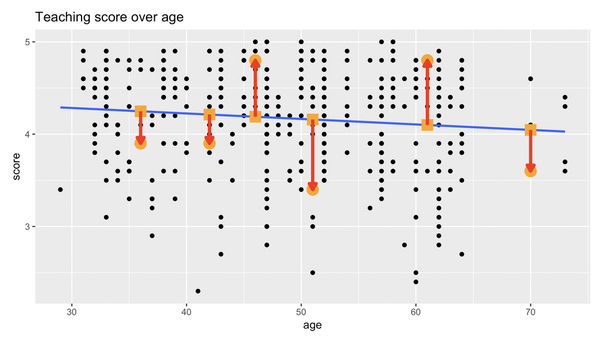

```{r setup, include=FALSE}
# Load knitr package
library(knitr)

# Knitr Options
opts_chunk$set(
	echo = TRUE,
	message = FALSE,
	warning = FALSE,
	fig.align = 'center'
)
```

# Summary
Equipped with your understanding of the **general modeling framework**, in this chapter we'll cover basic linear regression where you'll keep things simple and model the outcome variable $y$ as a function of a single explanatory/predictor variable $x$. We'll use both categorical and numerical $x$ variables. The outcome variable of interest in this chapter will be teaching evaluation scores of instructors at the University of Texas, Austin.

# Explaining Teaching Score with Age
Earlier, you explored the relationship between teaching score and age via a **scatter plot**.

```{r load-packages, message=FALSE, warning=FALSE}
# Load packages
library(tidyverse)
library(moderndive)
```

```{r scatter-score-age}
# Create a scatter plot of teaching score over age
ggplot(evals, aes(x = age, y = score)) +
  geom_point() +
  labs(x = "age", y = "score",
       title = "Teaching score over age")
```

You found that the relationship showed a correlation coefficient of **-0.107**, indicating a weakly negative relationship:

```{r corr-score-age}
evals %>% 
  summarise(correlation = cor(age, score))
```

You also saw that the scatter plot suffers from **overplotting**. Let's keep this overplotting in mind as we move forward. Now, can you visually summarise the above relationship with a **best-fitting line**? That is, a line that cuts through the cloud of points, separating the **signal** from the **noise**? We can do this using a **regression line**.

We can add a regression line to the `ggplot2` code by adding a `geom_smooth()` layer with `lm` for linear model and `se` equal `FALSE` to omit standard error bars (which are a concept for a more advance course).

```{r scatter-score-age-lm}
# Create a scatter plot of teaching score over age
ggplot(evals, aes(x = age, y = score)) +
  geom_point() +
  labs(x = "age", y = "score",
       title = "Teaching score over age") +
  # Add a "best-fitting" line
  geom_smooth(method = "lm", se = FALSE)
```

Observe. The overall relationship is negative; as ages increase, scores decrease. This is consistent with our computed correlation coefficient of -0.107. Now, does that mean aging directly causes decreases in score? Not necessarily, as there may be other factors we are not accounting for. Correlation does not equal causation.

This best-fitting line is the **linear regression line** and it is a fitted linear model $\hat{f}()$. Let's draw connections with our earlier modeling theory.

## Refresher: Modeling in General

* **Truth:** Assumed model is $y=f(\vec{x})+\epsilon$
* **Goal:** Given $y$ and $\vec{x}$, fit a model $\hat{f}(\vec{x})$ that *approximates* $f(\vec{x})$, where $\hat{y}=\hat{f}(\vec{x})$ is the *fitted/predicted* value for the *observed* value $y$.

## Modeling with Basic Linear Regression

* **Truth:** 
    * Assume $f()$ is a linear function (i.e. a line), necessitating an *intercept* ($\beta_0$) and a *slope* for $x$ ($\beta_1$): $f(x)=\beta_0+\beta_1\cdot{x}$
    * *Observed* value $y=f(x)+\epsilon=\beta_0+\beta_1\cdot{x}+\epsilon$ 
* **Fitted:**
    * Assume $\hat{f}(x)=\hat{\beta}_0+\hat{\beta}_1\cdot{x}$. These values are computed using our observed data.
    * *Fitted/predicted* value $\hat{y}=\hat{f}(x)=\hat{\beta}_0+\hat{\beta}_1\cdot{x}$. Note that there is no $\epsilon$ term here as our fitted model $\hat{f}(x)$ should only capture signal and not noise.
    
The best-fitting line is thus:
$\hat{y}=\hat{f}(\vec{x})=\hat{\beta}_0+\hat{\beta}_1\cdot{x}$

But what are the numerical values of the fitted intercept and slope? We'll let R compute these for us.

## Computing the Slope and Intercept of Regression Line
You first fit an `lm` linear model using as arguments the data and a model formula of form `y ~ x`, where `y` is the outcome and `x` is the explanatory variable.

```{r model-score-1}
# Fit regression model using formula of form: y ~ x
model_score_1 <- lm(score ~ age, data=evals)
# Output contents
model_score_1
```

While the intercept of 4.46 has a mathematical interpretation, being the value of $y$ when $x=0$, here it doesn't have a practical interpretation (this would be the teaching `score` when `age` is 0). The slope of -0.005938 quantifies the relationship between `score` and `age`. Its interpretation is **rise over run**; for every increase of 1 in `age` there is an associated decrease of on average 0.0059 units in score. The negative slope emphasizes the negative relationship.

However, the latter output is a bit sparse, and not in dataframe format. Let's improve thisby applying the `get_regression_table` function from the `moderndive` package to `model_score_1`.

```{r model-score-1-regression-table}
# Output regression table using wrapper function:
kable(get_regression_table(model_score_1))
```
This produces what is known as a **regression table**. This function is an example of a **wrapper function**. It takes other existing functions and hides its internal workings so that all you need to worry about are the input and output formats.

The fitted intercept and slope are now in the second column `estimate`. The additional columns, such as `std_error` and `p_value` all speak to the statistical significance of our results. These concepts are covered in more advanced courses on statistical inference.

# Plotting a Best-fitting Regression Line
Previously you visualised the relationship of teaching score and "beauty score" via a scatterplot. Now let's add a "best-fitting" regression line to provide a sense of any overall trends. Even though you know this plot suffers from overplotting, you'll stick to the non-`jitter` version.

```{r scatter-score-bty}
# Plot
ggplot(evals, aes(x = bty_avg, y = score)) +
  geom_point() +
  labs(x = "beauty score", y = "score") +
  geom_smooth(method = "lm", se = FALSE)
```

The overall trend seems to be positive. As instructors have higher "beauty" scores, so also do they tend to have higher teaching scores.

# Fitting a Regression with a Numerical $x$
Let's now explicitly quantify the linear relationship between `score` and `bty_avg` using linear regression. You will do this by first "fitting" the model. Then you will get the *regression table*, a standard output in many statistical software packages. Finally, based on the output of `get_regression_table()`, which interpretation of the slope coefficient is correct?

```{r model-score-2}
# Fit model
model_score_2 <- lm(score ~ bty_avg, data = evals)

# Output content
model_score_2
```

Given the sparsity of the output, let's get the regression table using the `get_regression_table()` wrapper function.

```{r model_score_2_regression_table}
kable(get_regression_table(model_score_2))
```

From this we can conclude that for every increase of one in beauty score, we can observe an associated increase of on average 0.067 units in teaching score.

# Predicting Teaching Score Using Age
Let's take our basic linear regression model of `score` as a function of `age` and now use it to **predict** events. For example, say we have demographic information about a professor at UT Austin. Can you make a good guess of their score? Or, more generally, based on a single predictor variable $x$ can you make good predictions $\hat{y}$?

Recall, our best-fitting regression line from the last section:

```{r scatter-score-age-2, echo=FALSE}
# Create a scatter plot of teaching score over age
ggplot(evals, aes(x = age, y = score)) +
  geom_point() +
  labs(x = "age", y = "score",
       title = "Teaching score over age") +
  # Add a "best-fitting" line
  geom_smooth(method = "lm", se = FALSE)
```
Now, say all you know about an instructor is that they are aged 40. What is a good guess of their score? Can you use the above visualisation? A good guess is the fitted value on the regression line for `age = 40`. This is approximately 4.25. To compute this precisely, you need to use the fitted intercept and fitted slope for age from the regression table.

## Refresher: Regression Table
[Previously](#modeling-with-basic-linear-regression) you learned how to fit a linear regression model with one numerical explanatory variable and applied the `get_regression_table()` function from the `moderndive` package to obtain the fitted intercept and fitted slope values:

```{r model-score-1-regression-table-2, echo=FALSE}
# Output regression table using wrapper function:
kable(
  get_regression_table(model_score_1))
```

Recall that these values are in the `estimate` column and are 4.46 and -0.006.

## Predicted Value
More generally, you can use a fitted regression model $\hat{f}()$ for predictive as well as explanatory purposes:

* Predictive regression models in general:<br>
$\hat{y}=\hat{f}(x)=\hat{\beta}_0+\hat{\beta}_1\cdot{x}$
* Our predictive model: $\hat{\text{score}}=4.46-0.006\cdot\text{age}$
* Our prediction: $4.46-0.006\cdot40=4.22$

This is very close to our earlier visual prediction of 4.25.

## Prediction Error
Now say we found out that the instructor actually got a score of 3.5. Our prediction of 4.22 **over-predicted** by approximately 0.72 units in the negative direction. What this demonstrates is the modeling concept of a **residual**.

## Residuals as Model Errors
A residual is the **observed value** $y$ minus the **fitted or predicted value** $\hat{y}$. This discrepancy between the two values corresponds to the $\epsilon$ from the general modeling framework. Here the negative residual of -0.72 corresponds to our over-prediction. With linear regression, sometimes you'll obtain positive residuals and sometimes negative. In linear regression these residuals always average out to 0.

* Residual = $y - \hat{y}$.
* Corresponds to the $\epsilon$ from the general modeling framework $y=f(\vec{x})+\epsilon$.
* For our example instructor: $y-\hat{y}=3.5-4.22=-0.72$.
* In linear regression, they are on average 0.

Now, say you want predicted $\hat{y}$ and residuals for all 463 instructors. You could repeat the procedure we just followed 463 times but this would be tedious. So let's automate this procedure using another wrapper function from the `moderndive` package.

## Computing All Predicted Values
Recall, our earlier fitted linear model, saved in the variable `model_score_1`. Instead of using `get_regression_table()`, let's now use `get_regression_points()` to get information on all 463 points in our datset.
```{r model-score-1-points}
# Fit regression model using formula of form: y ~ x
model_score_1 <- lm(score ~ age, data=evals)
# Get information on each point
model_score_1 %>% 
  get_regression_points() %>% 
  head(10) %>% 
  kable()
```

The first column `ID` identifies the rows. The second and third columns are the original outcome and explantory variables `score` and `age`. The fourth column `score_hat` is the predicted $\hat{y}$ as computed using the equation of the regression line. The fifth column is the residual, `score - score_hat`.

Let's go back to our original scatter plot and illustrate a few more residuals. Here's we'll plot six arbitrarily chosen residuals.

<center>

</center>

Our earlier statement that the regression line is **best-fitting** means that of all possible lines, the blue regression line **minimizes** the residuals. What do I mean by minimize? Imagine you drew all 463 residuals, then squared their lengths so that positive and negative residuals were treated equally, then summed them. The regression line is the line that minimizes this quantity. You'll see later that this quantity is called the **sum of squared residuals** and it measures the lack of fit of a model to a set of points. The blue regression line is best in that it minimizes this lack of fit.

# Making Predictions Using Beauty Score
Say there is an instructor at UT Austin and you know nothing about them except that their beauty score is 5. What is your prediction $\hat{y}$ of their teaching score $y$?
```{r model-score-2-regression-table-2}
get_regression_table(model_score_2)
```

Using the values of the intercept and slope from above, predict this instructor's score.
```{r predict-score-with-bty}
# Use fitted intercept and slope to get a prediction
y_hat <- 3.88 + 0.067 * 5
y_hat
```

Say it's revealed that the instructor's score is 4.7. Compute the residual for this prediction, i.e., the residual $y-\hat{y}$.
```{r residual-with-age}
# Use fitted intercept and slope to get a prediction
y_hat <- 3.88 + 5 * 0.0670
y_hat

# Compute residual y - y_hat
4.7 - 4.215
```

# Computing Fitted/Predicted Values & Residuals
Now say you want to repeat this for all 463 instructors in `evals`. Doing this manually as you just did would be long and tedious, so as seen in the video, let's automate this using the `get_regression_points()` function.

Furthemore, let's unpack its output.

* Let's once again get the regression table for `model_score_2`.
* Apply `get_regression_points()` from the `moderndive` package to automate making predictions and computing residuals.
```{r predict-all-scores-with-bty}
# Fit regression model
model_score_2 <- lm(score ~ bty_avg, data = evals)

# Get regression table
get_regression_table(model_score_2)

# Get all fitted/predicted values and residuals
get_regression_points(model_score_2)
```


* Let's unpack the contents of the `score_hat` column. First, run the code that fits the model and outputs the regression table.
* Add a new column `score_hat_2` which replicates how `score_hat` is computed using the table's values.
```{r predict-all-scores-with-bty-2}
# Fit regression model
model_score_2 <- lm(score ~ bty_avg, data = evals)

# Get regression table
get_regression_table(model_score_2)

# Get all fitted/predicted values and residuals
get_regression_points(model_score_2) %>% 
  mutate(score_hat_2 = 3.88 + 0.067 * bty_avg)
```

* Now let's unpack the contents of the `residual` column. First, run the code that fits the model and outputs the regression table.
* Add a new column `residual_2` which replicates how `residual` is computed using the table's values.
```{r predict-all-scores-with-bty-3}
# Fit regression model
model_score_2 <- lm(score ~ bty_avg, data = evals)

# Get regression table
get_regression_table(model_score_2)

# Get all fitted/predicted values and residuals
get_regression_points(model_score_2) %>% 
  mutate(residual_2 = score - score_hat)
```

# Explaining Teaching Score with Gender
Let's now expand your modeling toolbox with basic regression models where the explanatory/predictor variable is not numerical, but rather **categorical**. Much of the world's data is categorical in nature and its important to be equipped to handle it. You'll continue constructing explanatory and predictive models of teaching score, now using the variable gender, which at the time of this study was recorded as a binary categorical variable.

## Exploratory Data Visualization
As we similarly did in Chapter 1 for house price and house condition, let's construct an exploratory boxplot of the relationship between score and gender.
```{r boxplot-score-gender}
ggplot(evals, aes(x=gender, y=score)) +
  geom_boxplot() +
  labs(x="gender", y="score")
```

You can easily compare the distribution of scores for men and women using single horizontal lines. For example, it seems male instructors tended to get higher scores as evidenced by the higher median. Remember, the solid line in boxplots are the median, not the mean. So before I perform any formal regression modeling, I expect men will tend to be rated higher than women by students. Let's make a mental note: treating the median for women of about 4.1 as a "baseline for comparison", I observe a difference of about +0.2 for men. These aren't exact values, just a rough eyeballing.

## Facetted Histogram
An alternative exploratory visualization is a facetted histogram. You use `geom_histogram()`, where `x` maps to the numerical variable `score`, and where we now have facets split by gender.
```{r facetted-hist-score-gender}
ggplot(evals, aes(x=score)) +
  geom_histogram(binwidth=0.25) +
  facet_wrap(~gender) +
  labs(x="gender", y="score")
```

Unlike the boxplots, you now get a sense for the shape of the distributions. They both exhibit a slight **left-skew**. Nothing drastic like the right-skew of Seattle house prices, but still a slight skew nonetheless. However, it's now harder to say which distribution is centered at a higher point. This is because the median isn't clearly marked like in boxplots. Furthermore, comparisons between groups can't be made using single lines. So which plot is better? Boxplots or facetted histograms? There is no universal right answer; it all depends on what you are trying to emphasize to the consumers of these visualizations.

## Fitting a regression model
You fit the regression as before where the model formula `y ~ x` in this case has `x` set to `gender`.
```{r model-score-3-gender}
# Fit regression model
model_score_3 <- lm(score~gender, data=evals)

# Get regression table
model_score_3 %>% 
  get_regression_table() %>% 
  kable()
```


Using `get_regression_table()`, you see again the regression table yields a fitted intercept and a fitted slope, but what do these mean when the explanatory variable is categorical? The intercept 4.09 is the average score for the women, the "baseline for comparison" group. Why in this case is the baseline group female and not male? For no other reason than "female" is alphabetically ahead of "male". The slope of 0.142 is the difference in average score for men relative to women. This is known as a **dummy** or **indicator variable**. It is not that men had an average score of 0.142, rather they differed on average from the women by +0.142, so their average score is the sum of 4.09 + 0.142 = 4.23.

## Fitting a regression model
Let's convince ourselves of this by computing group means using the `group_by()` and `summarize()` verbs.
```{r group-means-score-gender}
# Compute group means based on gender
evals %>% 
  group_by(gender) %>% 
  summarise(avg_score = mean(score)) %>% 
  kable()
```

So, the latter table shows the means for men and women separately, whereas the regression table shows the average teaching score for the baseline group of women, and the relative difference to this baseline for the men.

## A Different Categorical Explanatory Variable: `rank`
Let's now consider a different categorical variable: `rank`. Let's group the `evals` data by `rank` and obtain counts using the `n()` function in the `summarize` call.
```{r count-rank}
# Get a count of records by rank
evals %>% 
  group_by(rank) %>% 
  summarise(n = n()) %>% 
  kable()
```

Observe three levels: First **teaching** instructors responsibilities' lie primarily only in teaching courses. Second, **tenure track** faculty also have research expectations and, generally speaking, are on the path to getting promoted to the third rank and highest, **tenured**.

