```{r setup, include=FALSE}
# Load knitr package
library(knitr)

# Knitr Options
opts_chunk$set(
	echo = TRUE,
	message = FALSE,
	warning = FALSE,
	fig.align = 'center'
)
```

# Summary
In the previous chapter, you learned about basic regression using either a single numerical or a categorical predictor. But why limit ourselves to using only one variable to inform your explanations/predictions? You will now extend basic regression to **multiple regression**, which allows for incorporation of more than one explanatory or one predictor variable in your models. You'll be modeling house prices using a dataset of houses in the Seattle, WA metropolitan area. 
```{r packages}
# Load the packages needed for this Chapter
library(dplyr)
library(moderndive)
library(ggplot2)
library(gridExtra)
```

# Explaining House Prices with Year and Size
Recall you performed EDAs of the relationship of `price` with variables such as `sqft_living` (numerical), `condition` (categorical with 5 levels) and `waterfront` (boolean).
```{r glimpse-selected-house-prices}
# Preview certain variables
house_prices %>% 
  select(price, sqft_living, condition, waterfront) %>% 
  glimpse()
```

You also saw the the outcome variable `price` was **right-skewed** as evidenced by the long right tail in its histogram. This skew was caused by a small number of very expensive houses, resulting in a plot where it is difficult to compare prices of the less expensive houses. This was also the case for the explanatory variable `sqft_living`.
```{r price-sqft-hists}
# Plot histogram of price
p1 <- 
  ggplot(house_prices, aes(x=price)) +
    geom_histogram() +
    labs(x = "price",
         title = "House prices in Seattle")

# Plot a histogram of log10_size
p2 <- 
  ggplot(house_prices, aes(x=sqft_living)) +
    geom_histogram() +
    labs(x = "square feet",
         title = "Size of houses in Seattle")

# Arrange side by side
grid.arrange(p1, p2, ncol=2)
```

We unskewed both variables using a **log-10 transformation** rendering them, in this case, both more symmetric and bell-shaped. Also, recall that a `log10_price` of $6$ corresponds to a `price` of $10^6$ or $1M.
```{r price-sqft-log10-hists}
# Add log10 transformations for both variables
house_prices <- house_prices %>% 
  mutate(log10_price = log10(price),
         log10_size = log10(sqft_living))

# Plot histogram of log10_price
p3 <- 
  ggplot(house_prices, aes(x=log10_price)) +
    geom_histogram() +
    labs(x = "log-10 price",
         title = "House prices in Seattle")

# Plot a histogram of log10_size
p4 <- 
  ggplot(house_prices, aes(x=log10_size)) +
    geom_histogram() +
    labs(x = "log-10 square feet",
         title = "Size of houses in Seattle")

# Arrange side by side
grid.arrange(p3, p4, ncol=2)
```

## Model for House Price
Let's explore the relationship between `price` and 2 explanatory variables: `log10_size` and `yr_built`.

* Outcome variable $y$ is the house price in USD: `price`
* Two numerical explanatory/predictor variables:
  * $x_1$ is house size: `log10_size`
  * $x_2$ is year built: `yr_built`

Let's perform an EDA.

While a scatterplot displays the relationship between 2 numerical variables, here we have 3 numerical variables. How can we visualise their joint relationship? By using a 3D scatterplot.

Here is a display of the 3D scatterplot for 500 randomly chosen houses.

<center>
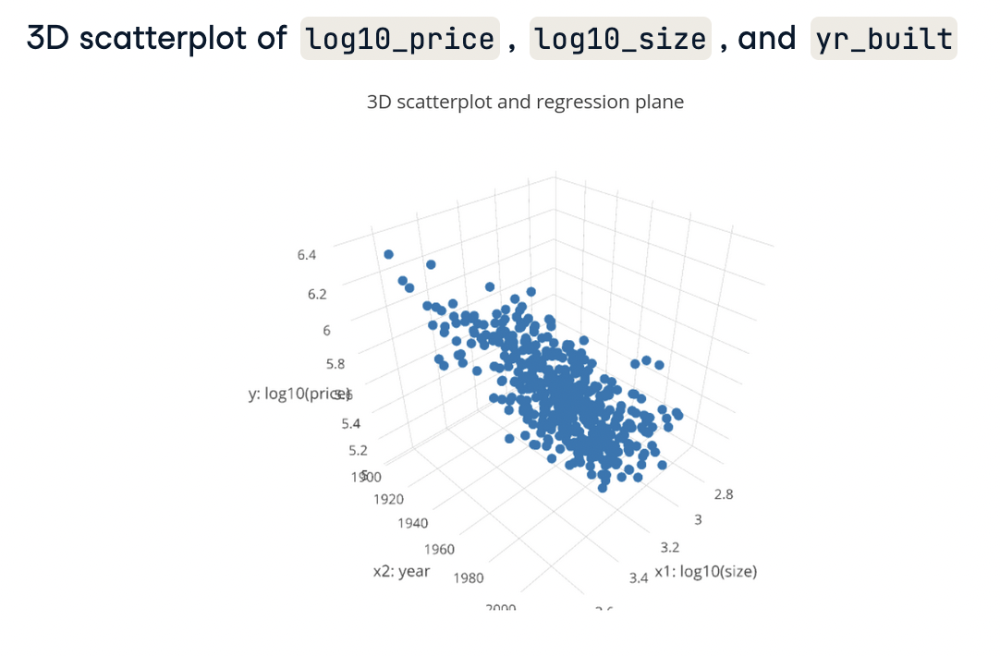
</center>

The outcome variable `log10_price` is on the vertical axis, while the two explanatory variables are on the bottom grid.

Now, how can we **visually summarise** the relationship between these points? In Chapter 2, when we had a 2D scatterplot, we used a regression line. The generalisation of a regression line in a 3D scatterplot is a **regression plane**.

Here is a snapshot of the corresponding regression plane that cuts through the cloud of points and best fits them.

<center>
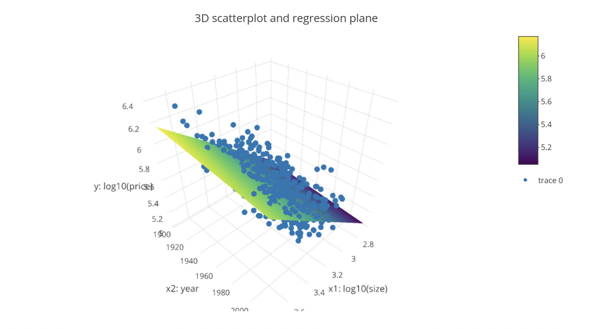
</center>

The interactive version of this plot can be found [here](https://chart-studio.plotly.com/~datacamp-content/1.embed). These 3D visualisations were created with the `plotly` package, which is a topic that would take too long to cover in this course so our exercises won't involve creating such plots.

Now, how can we **quantify** the relationships between these variables? By obtaining the values of the **fitted regression plane**.

Similarly as in Chapter 2, we can fit the model using the `lm()` function, but now with a model formula of form `y ~ x1 + x2` where the `+` indicates you are using more than one explanatory variable.
```{r fit-model-price-size-yr}
# Fit regression model using formula of form: y ~ x1 + x2
model_price_1 <- lm(log10_price ~ log10_size + yr_built,
                    data = house_prices)
```

You get the regression table just as before.
```{r model-price-1-regression-table}
# Get the regression table
get_regression_table(model_price_1) %>% 
  kable
```

The **intercept** here has no practical meaning, since there are no houses in Seattle built in the year 0. The first slope co-efficient suggests that taking into account all other variables, increases of 1 in `log10_size` are associated with increases of, on average, 0.913 in `log10_price`. In other words, taking into account the age of the home, larger homes tend to cost more.

Note, you preface your statement with "taking into account all other variables" since you are now jointly interpreting the associated effect of multiple explanatory variables that are in the same model.

Similarly, taking into account (or controlling for) `log10_size`, for every additional year in recency of construction, there is an associated decrease, on average, of -0.00138 in `log10_price`, suggesting that taking into account house size, newer houses tend to cost less.

# Explaining House Prices with Size and Number of Bedrooms
## EDA of Relationship
Unfortunately, making 3D scatterplots to perform an EDA is beyond the scope of this course. So instead let's focus on making standard 2D scatterplots of the relationship between price and the number of bedrooms, keeping an eye out for outliers.

Complete the `ggplot()` code to create a scatterplot of `log10_price` over `bedrooms` along with the best-fitting regression line.
```{r scatter-price-bedrooms}
# Create scatterplot with regression line
ggplot(data = house_prices, aes(x = bedrooms, y = log10_price)) +
  geom_point() +
  labs(x = "Number of bedrooms", y = "log10 price") +
  geom_smooth(method = "lm", se = FALSE)
```

There is one house that has 33 bedrooms. While this could truly be the case, given the number of bedrooms in the other houses, this is probably an outlier. Remove this outlier using `filter()` to recreate the plot.
```{r scatter-price-bedrooms-transform}
# Remove outlier
house_prices_transform <- house_prices %>% 
  filter(bedrooms < 33)

# Create scatterplot with regression line.
ggplot(data = house_prices_transform,
       aes(x = bedrooms, y = log10_price)) +
  geom_point() +
  labs(x = "Number of bedrooms", y = "log10 price") +
  geom_smooth(method = "lm", se = FALSE)
```

This demonstrates another important reason to perform EDA which is to discard any potential outliers that are likely data entry errors. In our case, after removing an outlier, you can see a clear positive relationship between the number of bedrooms and price, as one would expect. 

## Fitting a Regression
`house_prices_transform` has the log base 10 transformed variables included and the outlier house with 33 bedrooms removed. Let's fit a multiple regression model of `price` as a function of size and the number of bedrooms and generate the regression table. In this exercise, you will first fit the model.
```{r fit-model-price-size-bedrooms}
# Fit model
model_price_2 <- lm(log10_price ~ log10_size + bedrooms,
                    data = house_prices)

# Get regression table
get_regression_table(model_price_2) %>% 
  kable()
```

From this table we can say that accounting for `log10_size`, every extra bedroom is associated with a decrease of on average 0.033 in `log10_price`. In this multiple regression setting, the associated effect of any variable must be viewed in light of the other variables in the model. In our case, accounting for the size of the house reverses the relationship of the number of bedrooms and price from positive to negative.

# Predicting House Prices with Year and Size
Let's now use our first multiple regression model to make predictions. Just as you did for basic regression, let's first visually illustrate what it means to make predictions and then make explicit numerical ones. 

Let's consider only the regression plane from the last video to make predictions visually.

<center>
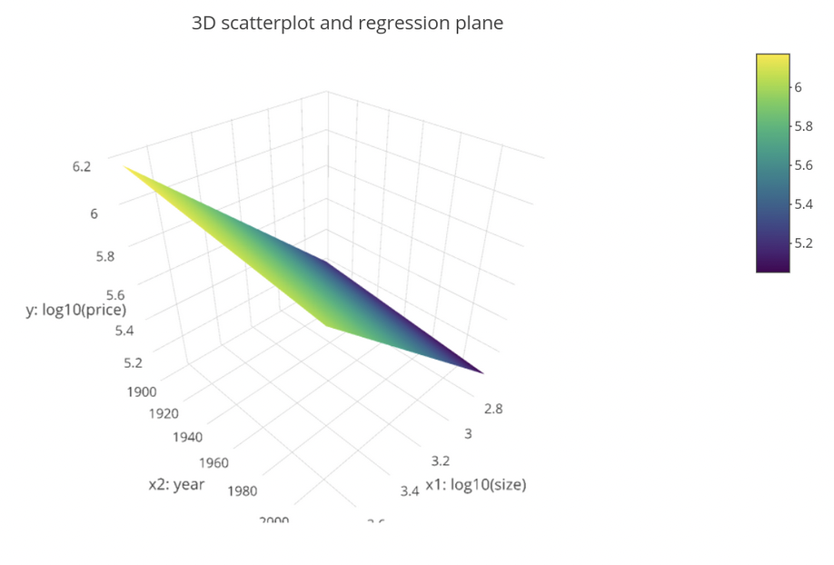
</center>

Say a house is for sale in Seattle and all you know is that its `log10_size` is 3.07 and that it was built in 1980. What is a good prediction of its `log10_price`?

This combination of `year = 1980` and `log10_size = 3.07`, marked with the intersecting dashed lines, corresponds to a fitted value $\hat{y}$ of 5.45 on the regression plane. This value is marked with a red dot.

<center>
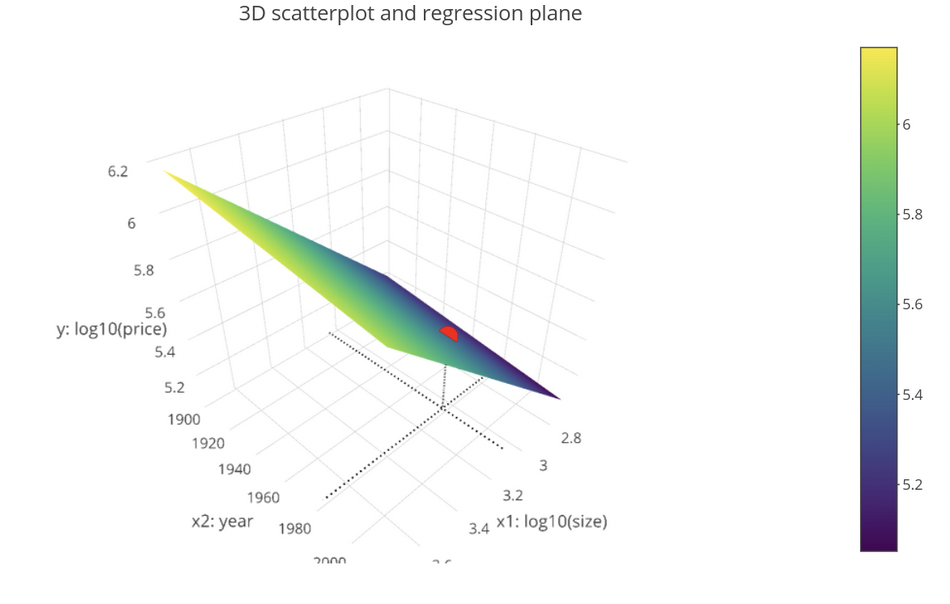
</center>

Let's now do the same but numerically. Let's take another look at the regression table.
```{r model-price-1-regression-table-2}
# Get the regression table
get_regression_table(model_price_1) %>% 
  kable
```

Recall that in multiple regression, all fitted slope coefficients are interpreted taking into account all other variables. So for example, taking into account the size of the house, for every additional year in recency of the house's construction there is an associated decrease of on average -0.00138 in log-10 price, suggesting a negative relationship.

## Predicted Value
Let's now use these values to numerically make the prediction we visually made earlier.
```{r predict-price-1}
# Make prediction
5.38 + 0.913 * 3.07 - 0.00138 * 1980
```

You plug in `log10_size = 3.07` and `year = 1980` into the fitted equation. This yields a fitted value of `log10_price` of 5.45. You undo the log transformation by raising 10 to the power of this value, yielding a predicted price for this house of about $282,000.
```{r convert-log-price-1}
# Convert back to original untransformed units
10^(5.45051)
```

## Computing all Predicted Values and Residuals
Just as you did for your predicted modeling examples from the last chapter, let's automate what we just did for all 21,000 houses. We'll do this using the `get_regression_points()` function. 
```{r model-price-1-get-regression-points}
# Output point-by-point information
get_regression_points(model_price_1) %>% 
  head(10) %>% 
  kable()
```

You previously saw that this function returns information on each point involved in a regression model. In particular, the second-to-last column `log10_price_hat` are the fitted, or predicted, values as we manually computed earlier for our example house. The last column `residual` consists of the residuals, i.e. the observed `log10_price` minus the predicted `log10_price`. Using the residuals, let's compute a measure of the model's fit or, more precisely speaking, lack thereof.

Let's take the 3D scatterplot and regression plane from before and mark a selection of residuals. We plot an arbitrarily chosen set of residuals with red vertical lines.

<center>
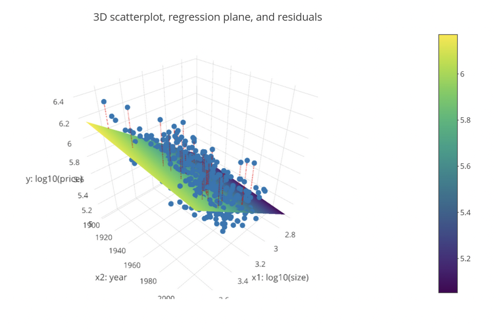
</center>

Remember, residuals are the discrepancies between the observed values (marked by the blue dots) and the fitted or predicted values marked by the corresponding point on the regression plane. These correspond to the $\epsilon$ error term in the general modeling framework we saw in Chapter 1.

Say you compute the residual for all 21,000 points, square the residuals and sum them. You saw earlier that this quantity is called the **sum of squared residuals**. It is a numerical summary of the lack of fit of a model to a set of points, in this case the regression plane. Hence larger values of the sum of squared residuals indicate poorer fit and smaller values indicate better fit. Just as with best-fitting regression lines, of all possible planes, the regression plane minimizes the sum of squared residuals. This is what is meant by best-fitting plane.

Let's now compute the sum of squared residuals. You start with all 21,000 residuals as shown in the table yielded by the `get_regression_points()` function. You then square them using `mutate()`, and then `summarise()` the squared residuals with their sum.
```{r model-price-1-ssr}
# Get sum of squared residuals
get_regression_points(model_price_1) %>% 
  mutate(sq_residual = residual ^ 2) %>% 
  summarise(sum_sq_residuals = sum(sq_residual))
```

The resulting value of 585 is difficult to interpret in absolute terms, however in relative terms it can be used to compare fits of different models that use different explanatory variables. Hence this allows us to identify which models fit best. This is a them we will revisit in Chapter 4 on model assessment and selection.

# Predicting House Prices with Size and Number of Bedrooms
Say you want to predict the price of a house using this model and you know it has:

* 1000 square feet of living space, and
* 3 bedrooms

What is your prediction both in log10 dollars and then dollars?
```{r model-price-2-predictions}
# Make prediction in log10 dollars
2.69 + 0.941 * log10(1000) - 0.033 * 3
```

```{r model-price-2-predictions-convert}
# Make prediction in dollars
10^5.414
```

Using the values in the regression table you can make predictions of house prices! In this case, your prediction is about $260,000. Let's now apply this procedure to all 21k houses!

## Interpreting residuals
Let's automate this process for all 21K rows in `house_prices` to obtain residuals, which you'll use to compute the sum of squared residuals: a measure of the lack of fit of a model.

Apply the relevant wrapper function to automate computation of fitted/predicted values and hence also residuals for all 21K houses using `model_price_2`.
```{r predict-all-prices}
# Automate prediction and residual computation
get_regression_points(model_price_2) %>% 
  mutate(sq_residual = residual ^ 2) %>% 
  summarise(sum_sq_residual = sum(sq_residual))
```

* The residual is the observed outcome variable minus the predicted variable.
* They can be thought of as prediction errors.
* They can be thought of as the lack-of-fit of the predictions to truth.

# Explaining House Prices with Size and Condition
Previously, we created a multiple regression model for house price using two numerical explanatory/predictor variables. However, multiple regression is not just limited to combinations of numerical variables. We can also use **categorical variables**. In this section, we will once again model `log10_price` as a function of the `log10_size` but now also consider the house's condition: a categorical variable with 5 levels, as seen in Chapter 1.

## Refresher: Exploratory Data Analysis
Let's review the EDA we performed in Chapter 1 of the relationship between `log10_price` and `condition`.
```{r eda-log10-price-condition}
# Group mean, sd and counts of log10_price and condition
house_prices %>% 
  group_by(condition) %>% 
  summarise(mean = mean(log10_price),
            sd = sd(log10_price),
            n = n()) %>% 
  kable()
```

We previously saw a roughly increasing trend in the mean as condition goes from 1 to 5, variation within each of the 5 levels of `condition` and the fact that most houses are of conditions 3, 4 or 5. Let's continue this EDA with some more exploratory visualisations.

<center>
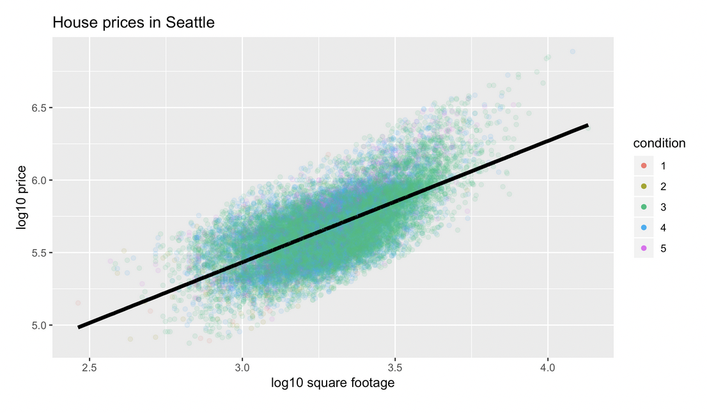
</center>

Here, we plot all 21K points in a coloured scatterplot where $x$ maps to the `log10_size`, $y$ maps to the `log10_price` and the colours of the points map to the condition. We also plot the overall regression line in black; in other words, the regression line for all houses irrespective of condition. However, wouldn't it be nice if we had separate regression lines for each colour (condition level)? This would allow us to consider the relationship between size and price separately for each condition. Let's do this.

<center>
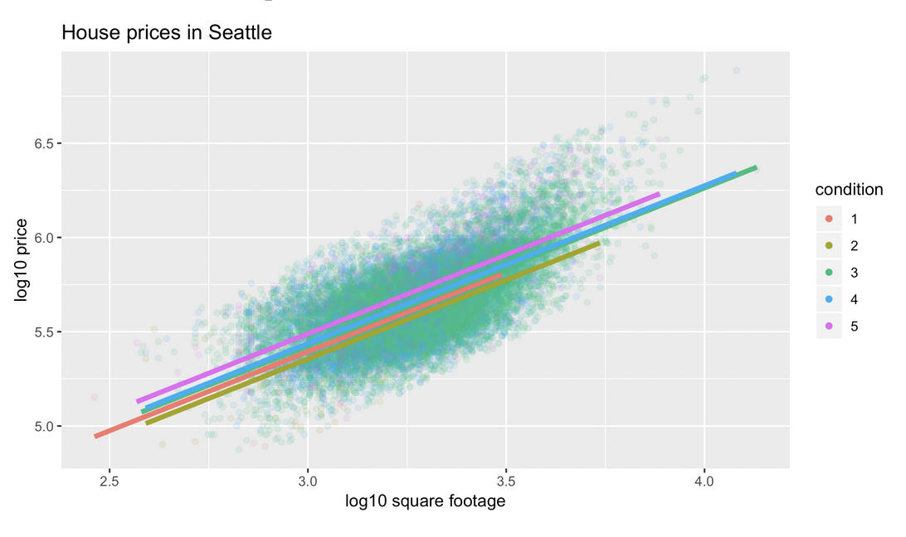
</center>

Above is the same scatterplot but now with 5 separate regression lines. Note, we are keeping things simple by having all 5 lines have the same slope but allowing for different intercepts. Observe, houses of condition 5 have the highest regression line, followed by 4, then 3, then 1 and then 2. This is known as the **parallel slopes model**.

An alternative visualisation is one split by facets.

<center>
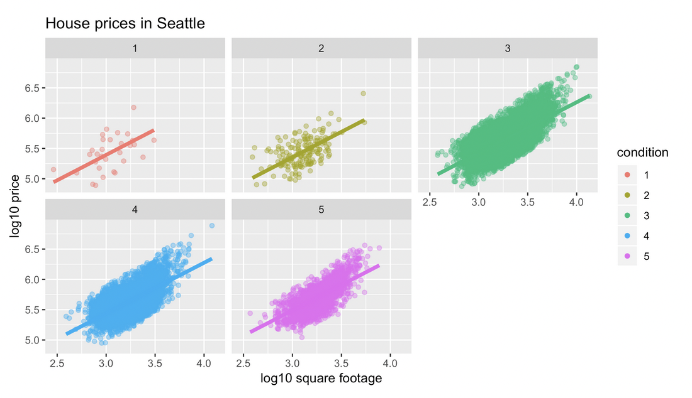
</center>

This plot really brings to light that there are very few houses of conditions 1 or 2. However, comparing the 5 regression lines here is harder than before. Which of these 2 plots is better? Again, there is no universal right answer. You need to make a choice depending on what you want to convey and own it.

## House Price, Size and Condition Relationship
Let's explicitly quantify these relationships by looking at the regression table.
```{r model-price-3}
# Fit regression model using formula of form: y ~ x1 + x2
model_price_3 <- lm(log10_price ~ log10_size + condition,
                    data = house_prices)

# Output regression table
get_regression_table(model_price_3) %>% 
  kable()
```


We once again fit a regression model using a formula where the $+$ sign separates our two explanatory variables and apply the `get_regression_table()` function.

Recall the notion of a baseline for comparison level when using a categorical variable in a regression model. In this case the baseline group is houses with condition equal to 1. 

Let's interpret the terms.

* The **fitted intercept** of 2.88 corresponds to the intercept of the baseline group which are the condition 1 houses. Those were in red in the previous plot.
* The **fitted slope** 0.837 for log10_size corresponds to the average increase in `log10_price` for every increase of 1 in `log10_size`. **Recall, the parallel slopes model dictates that all 5 groups have this same slope.**
* Condition 2, equal to -0.0385 is the **difference in intercept** or the **offset** for condition 2 houses relative to condition 1 houses. It is a negative value. This is reflected in the previous plot by the fact that the yellow regression line has a lower intercept than the red line.
* Conditions 3, 4 and 5 are interpreted similarly.

Observe that this offset is largest for condition 5 at 0.0956. This is reflected in the previous plot by the purple regression line having the highest intercept.

# Explaining House Prices with Size and Waterfront
## Parallel Slopes Model
Let's now fit a "parallel slopes" model with the numerical explanatory/predictor variable `log10_size` and the categorical, in this case binary, variable `waterfront`. The visualization corresponding to this model is below:

<center>
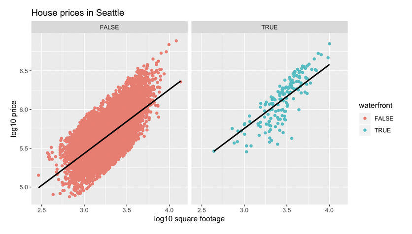
</center>

Fit a multiple regression of `log10_price` using `log10_size` and `waterfront` as the predictors.
```{r model-price-4}
# Fit a multiple regression model
model_price_4 <- lm(log10_price ~ log10_size + waterfront,
                    data = house_prices)

# Get regression table
get_regression_table(model_price_4) %>% 
  kable()
```

Notice how the regression table has three rows: intercept, the slope for `log10_size`, and an offset for houses that do have a waterfront. 

## Interpreting the Parallel Slopes Model
Let's interpret the values in the regression table for the parallel slopes model you just fit.

* The intercept for houses with a view of the waterfront is 3.282.
* The intercept for houses without a view of the waterfront is 2.96.
* All houses are assumed to have the same slope between `log10_price` and `log10_size`.

# Predicting House Prices with Size and Condition
Just as with multiple regression models using two numerical predictor variables, let's now predict house prices using models with one numerical and one categorical predictor variable. 

Previously, you made predictions on the same data you used to fit the model to, so you had access to the true observed sale price of these houses. Now let's consider a different scenario: making predictions on new data. This scenario could be thought of as the following: let's say the market hasn't changed much and a completely new house is put on the market. When you make the prediction, you won't know how good your prediction is since you don't know the true observed sale price yet. It's only after the house is sold that you can compare the prediction to the truth.

Recall our plot of the parallel slopes model where, for each of the 5 levels of the condition, you plot a separate regression line of `log10_price` over `log10_size`. While these 5 lines shared a common slope, they had different intercepts, with the houses of condition 5 having the highest intercept.

## Visualising Predictions
Say two new houses enter the market. One is of condition 3 and log-10 size 2.9 as marked with the green dashed line on the left. The other is of condition 4 and log-10 size 3.6 as marked with the blue dashed line on the right.

<center>
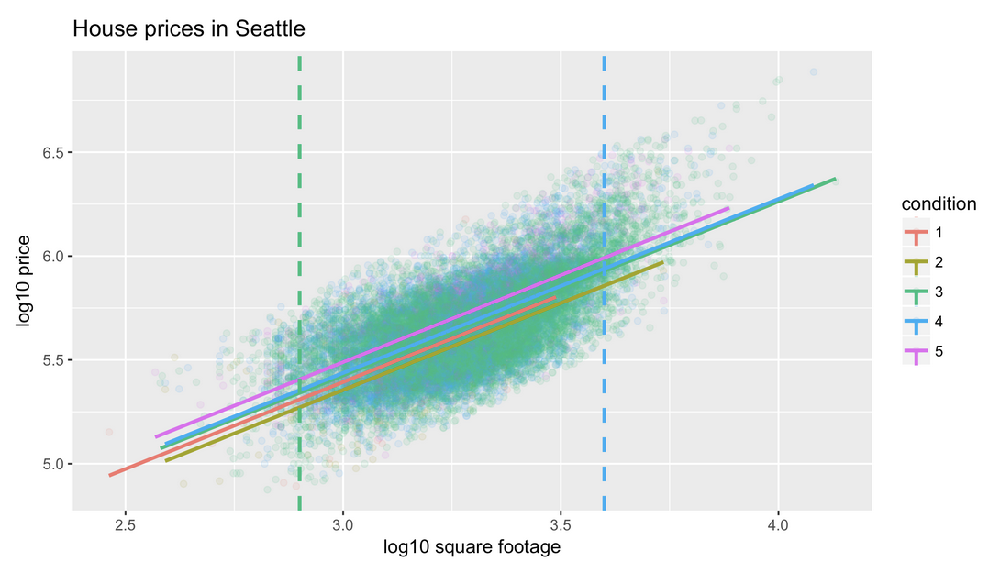
</center>

What are this model's predicted log-10 prices? They are the points at which the blue and green dashed lines intersect their corresponding regression lines.

For the first house, marked with a green dashed line, you would predict a log-10 price of around 5.4, or a sale price of around \$250,000. For the other house marked with the blue dashed line you would predict a log-10 price of just under 6, for a sale price of around \$1 million.

## Numerical Predictions
Now instead of making visual predictions, let's also make explicit numerical ones. Recall our regression table where the intercept corresponds to the baseline group, condition 1, the common slope associated with `log10_size` and the 4 offsets.
```{r model-price-3-regression-table}
# Get regression table
get_regression_table(model_price_3) %>% 
  kable()
```

The predicted price for the each house is:

* $\hat{y}$: intercept + offset for condition3 + estimate for log-10 size * house's log-10 size
* First house: $\hat{y} = 2.88 + 0.032 + 0.837 \times 2.90 = 5.34$
* Second house: $\hat{y} = 2.88 + 0.044 + 0.837 \times 3.6 = 5.94$

While doing this is fine for two new houses, imagine doing this for 1,000 new houses. This would take us forever! Fortunately, if the new house's information is saved in a spreadsheet or dataframe, you can automate the above procedure. 

## Defining 'new' data
Let's represent these two new houses in a manually created dataframe `new_houses` using the `data_frame()` function from the `dplyr` package. 
```{r create-new-houses-df}
# Create dataframe of new houses
new_houses <- data_frame(
  log10_size = c(2.9, 3.6),
  condition = factor(c(3,4))
)
  
# View the new df
new_houses %>% 
  kable()
```

Observe, `new_houses` has 2 rows corresponding to our 2 new houses. It also has 2 variables whose names and formats exactly match what they are in the original dataframe `house_prices`. For example, the variable `condition` was saved as a categorical variable in the original dataframe `house_prices` so in `new_houses` we convert the condition values 3 and 4 from numerical to categorical using the `factor()` function.

## Making Predictions Using New Data
You can once again use the `get_regression_points()` function to automate the prediction process, but this time we will use a new argument. We set `newdata` to the dataframe `new_houses` indicating that we want to apply the fitted model to a new set of observations.
```{r predict-new-data}
# Make predictions on new data
get_regression_points(model_price_3,
                      newdata = new_houses) %>% 
  kable()
```

Observe that the output contains the same predicted values `log10_price_hat` just like before.

Now say you want to obtain predictions of price rather than 1og-10 price. Use the `mutate()` function to raise 10 to the power of the variable `log10_price_hat` to obtain `price_hat`.
```{r new-data-predict-price}
# Convert log-10 price to price
get_regression_points(model_price_3,
                      newdata = new_houses) %>% 
  mutate(price_hat = 10^log10_price_hat) %>% 
  kable()
```

# Predicting House Prices with Size and Waterfront
Using your model for `log10_price` as a function of `log10_size` and the binary variable `waterfront`, let's make some predictions! Say you have the two following "new" houses, what would you predict their prices to be in dollars?

* House A: `log10_size = 2.9` that has a view of the waterfront
* House B: `log10_size = 3.1` that does not have a view of the waterfront

We make the corresponding visual predictions below:

<center>
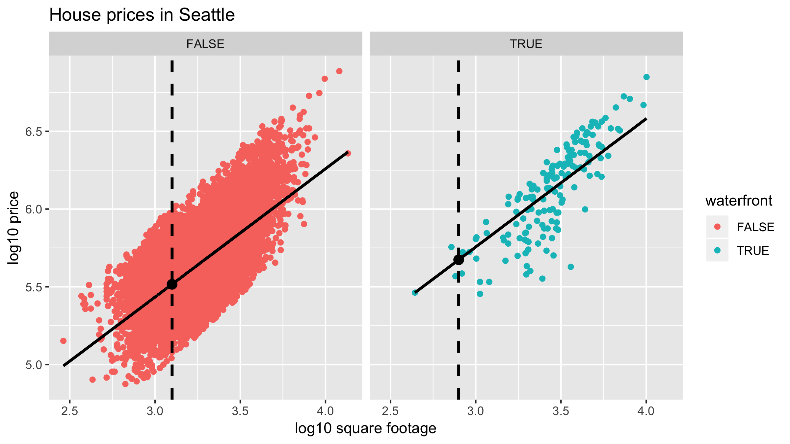
<>/center

After obtaining the regression table based on `model_price_4`, compute the predicted prices for both houses. First you'll use an equation based on values in this regression table to get a predicted value in log-10 dollars, then raise 10 to this predicted value to get a predicted value in dollars.

```{r model-price-4-regression-table}
# Get regression table
get_regression_table(model_price_4) %>% 
  kable
```

```{r model-price-4-prediction-1}
# Prediction for House A
10^(2.96 + 0.322 + 0.825 * 2.9)
```

```{r model-price-4-prediction-2}
# Prediction for House B
10^(2.96 + 0 + 0.825 * 3.1)
```

# Automating Predictions on New Houses
Let's now repeat what you did in the last exercise, but in an automated fashion assuming the information on these "new" houses is saved in a dataframe.

Your model for `log10_price` as a function of `log10_size` and the binary variable `waterfront` (`model_price_4`) is available in your workspace, and so is `new_houses_2`, a dataframe with data on 2 new houses. While not so beneficial with only 2 "new" houses, this will save a lot of work if you had 2000 "new" houses.
```{r create-df-new-houses-2}
# Build new df
new_houses_2 <- data_frame(
  log10_size = c(2.9, 3.1),
  waterfront = c(TRUE, FALSE)
)

# View the df
new_houses_2 %>% 
  kable()
```

Apply `get_regression_points()` as you would normally, but with the `newdata` argument set to our two "new" houses. This returns predicted values for just those houses.
```{r new-houses-get-regression-points}
# Get predictions on new houses
get_regression_points(model_price_4,
                      newdata = new_houses_2) %>% 
  kable()
```

Now take these two predictions in `log10_price_hat` and return a new column, `price_hat`, consisting of fitted price in dollars.
```{r new-houses-convert-log10-price}
# Get predictions price_hat in dollars on new houses
get_regression_points(model_price_4,
                      newdata = new_houses_2) %>% 
  mutate(price_hat = 10 ^ log10_price_hat) %>% 
  kable()
```

