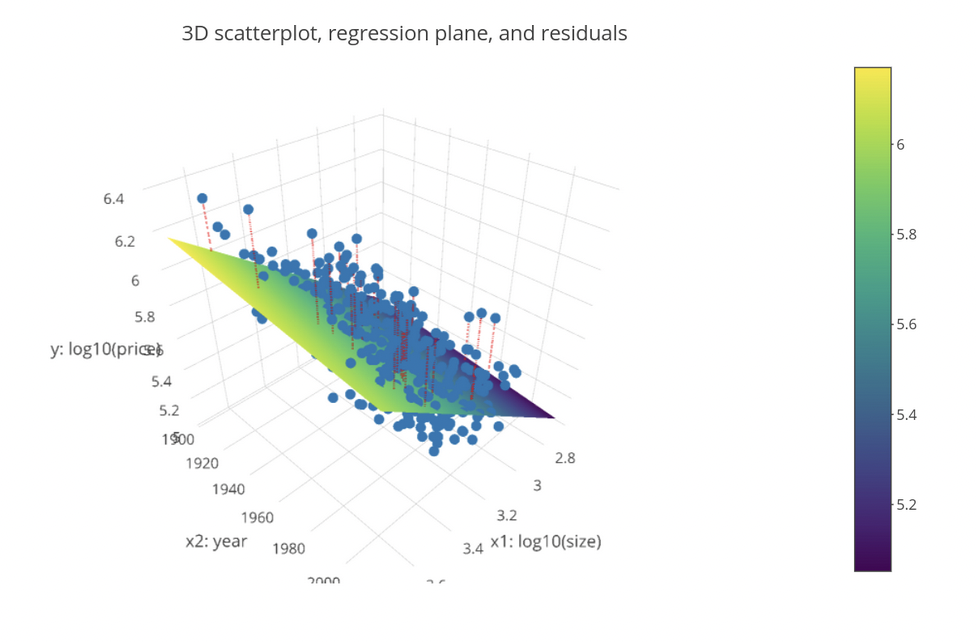

```{r setup, include=FALSE}
# Load knitr package
library(knitr)

# Knitr Options
opts_chunk$set(
	echo = TRUE,
	message = FALSE,
	warning = FALSE,
	fig.align = 'center'
)
```

# Summary
In the previous chapters, you fit various models to **explain** or **predict** an **outcome variable of interest**. However, how do we know which models to choose? **Model assessment measures** allow you to assess how well an explanatory model "fits" a set of data or how accurate a predictive model is. Based on these measures, you'll learn about criteria for determining which models are "best".
```{r packages}
# Load the packages needed for this Chapter
library(dplyr)
library(moderndive)
library(ggplot2)
library(gridExtra)
```

# Model Selection and Assessment
Let's recap what we have learned so far. After learning some [background modeling theory and terminology](https://rstudio-pubs-static.s3.amazonaws.com/853785_fe1d60d904f1459daae97c169144ed04.html#Background_on_Modeling_for_Explanation) in [Chapter 1](https://rpubs.com/SurreyDataGirl/datacamp-modeling-tidyverse-ch01), in [Chapter 2](https://rpubs.com/SurreyDataGirl/data-modelling-ch02) you modeled basic regressions using one explanatory or predictor $x$ variable. In [Chapter 3](https://rpubs.com/SurreyDataGirl/data-modelling-ch03), you extended this by using two $x$ variables. You created many models for both teaching `score` (from the `evals` dataset) and `house_price` (from the `house_prices` dataset).

However, you may be asking: how do I know which model to choose? In other words, **which models are best?** What do we mean by "best" and how do we assess this? In this chapter you will answer these questions via **elementary model assessment and selection**. In particular, you will assess the quality of the multiple regression models for Seattle house prices from Chapter 3.

But first, a brief refresher.

## Refresher: Multiple Regression
In [Chapter 3](https://rpubs.com/SurreyDataGirl/data-modelling-ch03) you studied two different multiple regression models for the outcome variable `log10_price`. 
```{r house-prices-add-log10-variables}
# Add log10 transformations for both variables
house_prices <- house_prices %>% 
  mutate(log10_price = log10(price),
         log10_size = log10(sqft_living))
```

The first, using two numerical explanatory or predictor $x$ variables: `log10_size` and `yr_built`.
```{r model-price-1-refresher}
# Model 1 - Two numerical:
model_price_1 <- lm(log10_price ~ log10_size + yr_built,
                    data = house_prices)
```

The other, using one numerical and one categorical $x$ variable: `log10_size` and `condition`.
```{r model-price-3-refresher}
# Model 3 - One numerical and one categorical:
model_price_3 <- lm(log10_price ~ log10_size + condition,
                    data = house_prices)
```

If you wanted to explain or predict house prices and you had to choose form these two models, which would you select? Presumably the better one? As suggested earlier this necessitates an explicit criteria for "better". Have you seen one so far? Yes, the **sum of squared residuals**.

## Refresher: Sum of Squared Residuals
Recall, a **residual** is an observed $y$ value minus its corresponding **fitted or predicted** value $\hat{y}$. In our case, `log10_price - log10_price_hat`. Visually they are the vertical distances between the blue points and their corresponding value on the regression plane. We have marked a small selection on the snapshot of the 3D visualisation below.

<center>

</center>

Furthermore, you learned that of all possible planes, the regression plane **minimizes** the sum of squared residuals. The sum of squared residuals is computed by squaring all 21,000 residuals and summing them. You saw that this quantity can be thought of as a **measure of lack of fit**, where larger values indicate a worse fit.

You computed this value explicitly in a [previous section](https://rstudio-pubs-static.s3.amazonaws.com/854388_cad21909414e4baf86544b3b13050e54.html#Computing_all_Predicted_Values_and_Residuals) for `model_price_1`, which uses `log10_size` and `yr_built` as $x$ variables.
```{r model-price-1-ssr}
# Model 1
get_regression_points(model_price_1) %>% 
  mutate(sq_residuals = residual ^ 2) %>% 
  summarise(sum_sq_residuals = sum(sq_residuals))
```

You saw that this model's sum of squared residuals was **585**, a number that is a bit hard to make sense of on its own.

However, let's compute the sum of squared residuals for `model_price_3` as well, which uses the categorical variable `condition` instead of the numerical variable `year`. 
```{r model-price-3-ssr}
# Model 3
get_regression_points(model_price_3) %>% 
  mutate(sq_residuals = residual ^ 2) %>% 
  summarise(sum_sq_residuals = sum(sq_residuals))
```

The sum of squared residuals is now **608**. So it seems that Model 3, using the variable `condition`, has a bigger lack of fit, so is worse, suggesting that Model 1, using `yr_built`, is better. 

# Refresher: Sum of Squared Residuals
Let's remind you how to compute the sum of squared residuals. You'll do this for two models.

* Use the appropriate function to get a dataframe with the residuals for `model_price_2`.
* Add a new column of squared residuals called `sq_residuals`.
* Then summarize `sq_residuals` with their sum. Call this sum `sum_sq_residuals`.
```{r model-price-2-ssr}
# Model 2
model_price_2 <- lm(log10_price ~ log10_size + bedrooms, 
                    data = house_prices)

# Calculate suqared residuals
get_regression_points(model_price_2) %>% 
  mutate(sq_residuals = residual ^ 2) %>% 
  summarise(sum_sq_residuals = sum(sq_residuals))
```

Now compute the sum of squared residuals for `model_price_4` which uses the categorical variable `waterfront` instead of the numerical variable `bedrooms`.
```{r model-price-4-ssr}
# Model 4
model_price_4 <- lm(log10_price ~ log10_size + waterfront, 
                    data = house_prices)

# Calculate squared residuals
get_regression_points(model_price_4) %>% 
  mutate(sq_residuals = residual ^ 2) %>% 
  summarise(sum_sq_residuals = sum(sq_residuals))
```

Let's use these two measures of model assessment to choose between these two models, or in other words, perform model selection!

## Which Model to Select?
Based on these two values of the sum of squared residuals, which of these two models do you think is "better", and hence which would you select?

* `model_price_2` that uses `log10_size` and `bedrooms`?
* `model_price_4` that uses `log10_size` and `waterfront`?

**Since `model_price_4`'s value was 599, select this one.** Given the choice of just these two models, the evidence suggests using size and waterfront yield a better fit, so you should choose this one!

# Assessing Model Fit with R-Squared
Now that you've reviewed the sum of squared residuals with an eye towards model assessment and selection, let's learn about another measure of a model's fit: the widely known **R-squared**.

## R-Squared
$$
R^2 = 1 - \frac{\text{Var(residuals)}}{\text{Var}(y)}
$$
R-squared is another numerical summary of how well a model fits points. It is **1 minus the variance of the residuals over the variance of the outcome variable**. If you've never heard of a variance, it’s another measure of variability/spread and its the standard deviation squared. Instead of focusing on the formula however, let's first focus on the intuition: While the sum of squared residuals is **unbounded**, meaning there is no theoretical upper limit to its value, R-squared is **standardized to be between 0 and 1**. Unlike the sum of squared residuals where smaller values indicate better fit, larger values of R-squared indicate better fit. So **1 indicates perfect fit**, and **0 indicates perfect lack of fit**, in other words no relationship between the outcome and explanatory/predictor variables. Let's explore these ideas visually.

* $R^2$ is between 0 and 1.
* Smaller $R^2$ ~ poorer "fit".
* $R^2 = 1$ ~ "perfect fit" and $R^2 = 0$ ~ "no fit".

## High R-Squared Value Example
<center>

</center>

Let's revisit basic regression with one numerical variable and consider a set of points with a perfectly linear relationship. In other words, the points fall perfectly on a line. Recall residuals are the vertical distances between the observed values, here the black points, and the corresponding fitted/predicted values on the blue regression line. Here, the residuals are all invariably 0. Thus the variance, or variation, of the residuals is 0, and thus $R^2$ is equal to $1-0$, which is 1.

## Low R-Squared Value Example
<center>

</center>
Now the points don't fit tightly on a line, but rather exhibit a large amount of scatter. Unlike the previous example, there are now varying residuals, thus the numerator is greater than zero, so R-squared will be smaller. Note that it is a mathematical fact that the variance of y is greater than or equal to the variance of the residuals, guaranteeing that R-squared is between 0 and 1. 

Using this fact, the numerical interpretation of R-squared is as follows: it is the proportion of the total variation in the outcome variable y that the model explains. Our models attempt to explain the variation in house prices. For example, what makes certain houses expensive and others not? The question is, how much of this variation can our models explain? If it's 100%, then our model explains everything! If its 0%, then our model has no explanatory power. 

* Since $\text{Var}(y)\ge\text{Var(residuals)}$ and;
* $R^2=1-\frac{\text{Var(residuals)}}{\text{Var}(y)}=\frac{\text{Var}(y)-\text{Var(residuals)}}{\text{Var}(y)}$ then;
* $R^2$'s interprestation is: *the proportion of the total variation in the outcome variable $y$ that the model explains*.

## Computing R-squared
Let's compute the R-squared statistic for both models we saw in the last Chapter.
```{r model-price-1-rsq}
# Model 1: price as a function of size and year built
get_regression_points(model_price_1) %>% 
  summarise(r_squared = 1 - var(residual)/var(log10_price))
```

In both cases, the outcome variable $y$ is the observed `log10_price`. For Model 1, which used `log10_size` and `yr_built`, the $R^2$ is **0.483 or 48.3%**. So you can explain about half the total variation in house prices using Model 1.
```{r model-price-3-rsq}
# Model 3: price as a function of size and condition
get_regression_points(model_price_3) %>% 
  summarise(r_squared = 1 - var(residual)/var(log10_price))
```

For Model 3, which used `condition` instead of `yr_built`, the $R^2$ is **0.462 or 46.2%**. Now a lower proportion of the total variation in house prices is explained by Model 3. Since R-squared values closer to 1 mean better fit, the results suggest you choose Model 1, and thus using size and year is preferred to using size and condition. This is the same conclusion reached as when you used sum of squared residuals as the assessment criteria. Note however, sometimes there are no models that yield R-squared values close to 1. Sometimes the phenomenon you are modeling is so complex, no choice of variables will capture its behavior, and thus you only get low R-squared values. 

# Computing the R-Squared of a Model
Let's compute the $R^2$ summary value for the two numerical explanatory/predictor variable model you fit in the Chapter 3, price as a function of size and the number of bedrooms.

Compute $R^2$ by summarizing the `residual` and `log10_price` columns.
```{r model-price-2-rsq}
# Get fitted/values & residuals, compute R^2 using residuals
get_regression_points(model_price_2) %>% 
  summarise(r_squared = 1 - var(residual)/var(log10_price))
```

You observed an R-squared value of **0.465**, which means that 46.5% of the total variability of the outcome variable log base 10 price can be explained by this model. 

# Comparing the R-Squared of Two Models
Let's now compute $R^2$ for the one numerical and one categorical explanatory/predictor variable model you fit in the Chapter 3, price as a function of size and whether the house had a view of the waterfront, and compare its $R^2$ with the one you just computed.
```{r model-price-4-rsq}
# Get fitted/values & residuals, compute R^2 using residuals
get_regression_points(model_price_4) %>% 
  summarise(r_squared = 1 - var(residual) / var(log10_price))
```

Since `model_price_4` had a higher $R^2$ of 0.470, it "fit" the data better. Since using waterfront explained a higher proportion of the total variance of the outcome variable than using the number of bedrooms, using waterfront in our model is preferred.

# Assessing Predictions with RMSE
You just learned about R-squared, the proportion of the total variation in house prices that is explained by a model. This numerical summary can be used to assess model fit, where models with $R^2$ values closer to 1 have better fit and values closer to 0 have poorer fit.

Let's now consider another assessment measure, but one more associated with modeling for prediction. In particular, how can you assess the quality of a model's predictions? You'll use a quantity called the **Root Mean Squared Error** which is a slight variation of the sum of squared residuals.

## Refresher: Residuals
Once again, recall in your visualization of modeling with two numerical predictor variables, you marked a selection of residuals with red lines: the difference between the observed values and their corresponding fitted/predicted values on the regression plane. The sum of squared residuals takes all such residuals, squares them, and sums them. But what if you took the average instead of the sum? For example, a model might have a large sum of squared residuals, merely because it involves a large number of points! By using the average, we’ll correct for this and get a notion of "average prediction error”.

<center>

</center>

## Mean Squared Error
You've seen the computation of the sum of squared residuals for Model 1 a few times now. Instead of using `sum()` in the `summarize()` call however, let's use the `mean()` function and assign this to `mse`, meaning **mean squared error**. This is the average squared error a predictive model makes. The closer your predictions $\hat{y}$ are to the observed values $y$, the smaller the residuals will be, and hence the closer the MSE will be to 0. The further your predictions are, the larger the MSE will be.
```{r model-price-1-mse}
# Mean squared error: use mean() instead of sum()
get_regression_points(model_price_1) %>% 
  mutate(sq_residuals = residual^2) %>% 
  summarise(mse = mean(sq_residuals))
```

You observe an MSE of **0.0271**, which is 585 divided by 21613, the total number of houses. Why is this called the MSE, and not the mean of squared residuals? No reason other than convention, they mean the same thing.

## Root Mean Squared Error
Since the MSE involves squared errors, the units of MSE are the units of the outcome variable $y$ squared. Let's instead obtain a measure of error whose units match the units of y. 

You do this via the **root mean squared error**, or RMSE, which is the square-root of the MSE.
```{r price-model-1-rmse}
# Root mean squared error
get_regression_points(model_price_1) %>% 
  mutate(sq_residuals = residual^2) %>% 
  summarise(mse = mean(sq_residuals)) %>% 
  mutate(rmse = sqrt(mse)) %>% 
  kable()
```

Note the added `mutate()` line of code to compute the `sqrt()`. This can be thought of as the "typical prediction error" our model will make and its units match the units of the outcome variable $y$. While the interpretation in our case of the units of log10 dollars might not be immediately apparent to everyone, you can imagine in many other cases it being very useful for these units match.

## RMSE of Predictions on New Houses
Let's now assess the quality of the predictions of `log10_price` for the two new houses you saw in the previous chapter.
```{r new-houses}
new_houses <- data_frame(
  log10_size = c(2.9, 3.6),
  condition = factor(c(3, 4))
)

new_houses %>% 
  kable()
```

Recall that you apply the `get_regression_points()` function to `model_price_3`, but also with the `newdata` argument set to `new_houses`.
```{r get-regression-points-new-houses}
# Get predictions
get_regression_points(model_price_3,
                      newdata = new_houses) %>% 
  kable()
```

You thus obtain predicted values `log10_price_hat` of 5.34 and 5.94. Now let's take this output and compute the RMSE by taking the residual, squaring them, taking the mean not the sum, and then square rooting.
```
# Compute RMSE
get_regression_points(model_price_3,
                      newdata = new_houses) %>% 
  mutate(sq_residuals = residual^2) %>% 
  summarise(mse = mean(sq_residuals)) %>% 
  mutate(rmse = sqrt(mse))
```

You get the following error message:
```
Error in mutate_impl(.data, dots) :
  Evaluation error: object 'residual' not found.
```
It says the residual column is not found. Why is it not found? Because to compute residuals, you need both the predicted/fitted values y-hat, in this case log10-price-hat and the observed values y, in this case log10-price But if you don't have the latter, you can't compute the residuals, and hence you can’t compute the RMSE. This illustrates a key restriction in predictive modeling assessment: you can only assess the quality of predictions when you have access to the observed value y. You'll learn about a workaround to this issue shortly. 